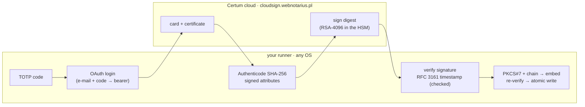

# Super Simply Sign

**Authenticode-sign Windows binaries with a Certum SimplySign cloud certificate
from GitHub Actions — pure HTTPS, Node 24, no SimplySign Desktop, no PKCS#11,
on any runner OS.** · **在 GitHub Actions 里用 Certum SimplySign 云证书给
Windows 程序做 Authenticode 签名——纯 HTTPS，Node 24，不需要 SimplySign
Desktop，任意 runner 系统。**

🇬🇧 [English](#english) · 🇨🇳 [中文](#中文)



> Not affiliated with or endorsed by Certum / Asseco. "Certum" and
> "SimplySign" are their trademarks; this is an independent client for their
> public API, following the flow documented by
> [Le-Syl21/ssign](https://github.com/Le-Syl21/ssign).

---

## English

- [What it does — and doesn't](#what-it-does--and-doesnt)
- [Quick start](#quick-start)
- [Inputs](#inputs)
- [Outputs](#outputs)
- [⚠️ The OTP seed is a long-lived secret](#️-the-otp-seed-is-a-long-lived-secret)
- [Secure setup: owner approval for every signature](#secure-setup-owner-approval-for-every-signature)
- [Verifying a signed file](#verifying-a-signed-file)
- [How it works](#how-it-works)
- [Security design](#security-design)
- [Development](#development)
- [Acknowledgements](#acknowledgements)

### What it does — and doesn't

| ✅ Does | ❌ Does not |
| --- | --- |
| Authenticode-sign **PE** images: `.exe`, `.dll`, `.sys`, `.ocx`, `.cpl`, … | **MSI / MSP / MSM**, CAB, `.cat`, PowerShell scripts, APPX/MSIX |
| Embed the **full chain** (leaf + *Certum Code Signing 2021 CA*) | Dual SHA-1 + SHA-256 signatures (SHA-256 only) |
| Add an **RFC 3161 timestamp** (`time.certum.pl`), verified before it is embedded | Sign with anything but a **Certum SimplySign** cloud certificate |
| Sign many files on **one login**, on Linux, macOS or Windows runners | Cards that require a **PIN** (the HTTPS flow cannot supply one) |
| **Re-verify** every signed file before writing it | Replace `signtool` for chain-trust verification (see [below](#verifying-a-signed-file)) |

### Quick start

```yaml
name: Sign

on:
  workflow_dispatch:        # manual only — every run performs a real cloud signature

permissions:
  contents: read

jobs:
  sign:
    runs-on: ubuntu-latest
    environment: signing    # ← protected environment; see "Secure setup"
    steps:
      - uses: actions/checkout@v7
      - uses: actions/download-artifact@v8
        with: { name: build, path: dist }

      - uses: IvanHanloth/super-simply-sign@v1      # pin to a commit SHA in production
        id: sign
        with:
          files: |
            dist/*.exe
            dist/*.dll
          description: My App
          url: https://example.com
          email: ${{ secrets.CERTUM_EMAIL }}
          otp-seed: ${{ secrets.CERTUM_OTP }}

      - run: echo '${{ steps.sign.outputs.signed-files }}' | jq .
      - uses: actions/upload-artifact@v7
        with: { name: signed, path: dist/ }
```

Files are signed **in place** by default; use `output-dir` to write elsewhere
or `backup: true` to keep `<file>.orig`.

### Inputs

| Input | Required | Default | Description |
| --- | --- | --- | --- |
| `files` | yes | — | Glob patterns, one per line (or comma-separated). PE images only. |
| `email` | yes* | `$CERTUM_EMAIL` | Certum account e-mail. |
| `otp-seed` | one of | `$CERTUM_OTP` | TOTP seed of the SimplySign authenticator — base32 or full `otpauth://` URI. **Long-lived secret.** |
| `otp-code` | one of | `$CERTUM_TOKEN` | A *current* 6-digit code, for a one-off run without handing the seed to CI. |
| `timestamp-url` | no | `http://time.certum.pl/` | RFC 3161 TSA. Empty disables timestamping (loud warning). |
| `description` | no | — | Program name embedded in the signature (what Windows shows). |
| `url` | no | — | Information URL embedded in the signature. |
| `output-dir` | no | — | Write signed files here instead of in place. |
| `backup` | no | `false` | Keep `<file>.orig` when signing in place (never overwrites an existing backup). |
| `replace-existing-signature` | no | `false` | Strip and replace an existing signature instead of failing. |
| `chain-file` | no | — | PEM bundle with extra intermediates to embed. |
| `card-serial` | no | first card | `cardno` of the SimplySign card to use. |
| `verify` | no | `true` | Re-parse and cryptographically verify every signed file before writing it. |
| `allow-pull-request` | no | `false` | Permit running on `pull_request` events. |
| `fail-on-no-files` | no | `true` | Fail when nothing matches. |

\* `email` and the OTP inputs may also come from the environment variables
`CERTUM_EMAIL`, `CERTUM_OTP` and `CERTUM_TOKEN` (same names as the `ssign`
CLI), so a job can set them once for several steps.

### Outputs

| Output | Description |
| --- | --- |
| `signed-files` | JSON array of `{ path, sha256, bytes, timestamp }` for every signed file. |
| `signed-count` | Number of files signed. |
| `certificate-subject` | Subject of the signing certificate. |
| `certificate-fingerprint` | SHA-256 fingerprint of the signing certificate. |
| `certificate-not-after` | Expiry of the signing certificate (ISO 8601). |

A job summary lists every file with its SHA-256 and timestamp.

### ⚠️ The OTP seed is a long-lived secret

`otp-seed` (`CERTUM_OTP`) is the base32 secret behind your SimplySign
authenticator. **Anyone who has it plus your e-mail can sign code as you,
indefinitely**, until you re-issue the SimplySign QR code. Treat it like a
private key:

- store it as a **protected environment secret with required reviewers**
  (next section), never as a plain repository secret;
- prefer `otp-code` — a single 6-digit code, dead within ~30 s — for manual,
  one-off signing, so the seed never leaves your authenticator;
- if it ever leaks, **rotate it**: re-issue the QR code from your Certum
  account.

The e-mail address is not sensitive. Inside the action the seed is masked,
turned into the current code, and wiped; only the 6-digit code is ever sent —
to `cloudsign.webnotarius.pl`, over HTTPS, and nowhere else.

### Secure setup: owner approval for every signature

Signing spends your certificate's reputation; a mistake or a leak is costly.
Gate it behind a **GitHub environment** so the repository owner must approve
each run before the job can even read the secrets:

1. **Settings → Environments → New environment**, name it `signing`.
2. Add a **Deployment protection rule → Required reviewers** with yourself.
3. Store `CERTUM_EMAIL` and `CERTUM_OTP` as **environment secrets** of
   `signing`.
4. Declare `environment: signing` on the signing job (as in the quick start).

A pull request — even a malicious one — cannot trigger a signature or read the
seed: every run waits for the reviewer's click, and the action itself refuses
to run on `pull_request` events unless `allow-pull-request: true` is set.

In a release pipeline, make signing a **job in the same workflow** as the
build, with the release job `needs:` it, so a tag becomes *build → approve →
signed release*. (A release created with the built-in `GITHUB_TOKEN` does not
trigger other workflows, so a separate `release: published` workflow will not
fire.)

### Verifying a signed file

The action re-verifies its own output (digest, signature, timestamp) before
writing it, but chain trust is the operating system's job. To check a signed
file the way Windows does — the command Certum's own handbook recommends:

```bash
signtool verify /pa /all app.exe
```

On Linux/macOS, [osslsigncode](https://github.com/mtrojnar/osslsigncode):

```bash
osslsigncode verify app.exe
```

### How it works

The pipeline is the one `ssign` validated against the real service —
`otp → auth (OAuth) → card → sign (SCS1_ATOM) → authenticode (hash + PKCS#7) → timestamp (RFC 3161)` —
re-implemented in TypeScript on Node 24:

1. **TOTP** (RFC 6238, SHA-256, 6 digits, 30 s) from the seed, or the literal
   code you passed.
2. **Login**: OAuth 2.0 authorization code through Certum's CAS identity
   provider (e-mail + code as the password) → bearer token, valid ~30 min,
   kept in memory only.
3. **Card**: list cards, fetch the signing certificate (PEM, kept verbatim).
4. **Digest**: the Authenticode SHA-256 of the PE, computed per Microsoft's
   specification (headers, sections in file order, trailing data), plus the
   signed attributes; what the HSM signs is the SHA-256 of those attributes.
5. **Sign**: one async task per file → RSA-4096 PKCS#1 v1.5 signature,
   verified against the certificate before anything else happens.
6. **Timestamp**: RFC 3161 request with a nonce; the token is accepted only if
   it covers this signature, echoes the nonce, verifies with the TSA
   certificate it carries, and that certificate is a time-stamping one.
7. **Assemble**: PKCS#7 SignedData with the leaf + intermediate, the
   timestamp as an unauthenticated attribute, spliced into the PE's
   certificate table; PE checksum updated.
8. **Verify and write**: the signed image is parsed and verified again, then
   written atomically.

Details, endpoints and wire formats: [`docs/PROTOCOL.md`](docs/PROTOCOL.md).

### Security design

The full threat model and the handling of every secret are in
[`SECURITY.md`](SECURITY.md). In short:

- **No third-party cryptography or HTTP libraries.** TOTP, DER, X.509 chain
  handling, PKCS#7/Authenticode, RFC 3161 and the HTTP client are implemented
  in this repository on top of `node:crypto` and Node's built-in `fetch`, all
  under test. Runtime dependencies: `@actions/core`, `@actions/glob`. Fewer
  packages, shorter supply chain.
- **Secrets never leave the runner except as intended.** Every HTTP client is
  pinned to an allowlist of origins; redirects and `atom:link`s are followed
  by hand and refused if they point elsewhere; the OAuth code is read off the
  redirect chain without requesting the redirect target; URLs in errors have
  their query strings stripped; seed, code, token, cookies and card serial are
  masked with `setSecret`. No session cache on disk.
- **Nothing is trusted unverified.** The cloud's signature is checked against
  the certificate, the TSA's token against our request, and the final image
  against itself, before a single byte is written.
- **Guard rails**: no `pull_request` runs by default, timestamping on by
  default, existing signatures not replaced by default, atomic writes,
  backups never overwritten.
- **Cross-checked** against Microsoft's implementation: an image signed by
  `signtool` (with a genuine Certum timestamp) verifies with this action's
  verifier, and this action's output passes `signtool verify` and
  `Get-AuthenticodeSignature` up to chain trust, timestamp included.

### Development

```bash
npm ci
npm run check      # typecheck + tests (which build dist/ first)
```

- Node ≥ 24; the action runs on `runs.using: node24`.
- Tests use `node:test` only. They spin up a local stand-in for the Certum
  cloud (CAS login, async tasks, signature, TSA) and generate fresh keys on
  every run — no private key is committed.
- `dist/index.cjs` is the bundle the runner executes; commit it with every
  source change (CI fails otherwise).
- `node tools/local-crosscheck.ts in.exe out.exe [http://time.certum.pl/]`
  signs through the whole pipeline against a local stand-in for the cloud
  (fresh keys) and, optionally, the real Certum TSA; check the result with
  `signtool verify /pa /v` — this is the run that validated the action against
  Microsoft's verifier.
- Releasing: bump `version` in `package.json` / `src/signer.ts`, build,
  commit, tag `vX.Y.Z` and move the `v1` tag.

### Acknowledgements

- **[Le-Syl21/ssign](https://github.com/Le-Syl21/ssign)** — reverse-engineered
  the SimplySign cloud protocol and proved the pure-HTTPS flow end to end; the
  flow, the intermediate certificate and the `hello.exe` test fixture (MIT)
  come from there.
- **Certum**, *Code Signing in the Cloud — Signing in Signtool and Jarsigner*
  (official handbook): the reference for the signtool parameters, timestamp
  server and certificate bundle order this action reproduces.
- **[osslsigncode](https://github.com/mtrojnar/osslsigncode)** — the source of
  the Authenticode digest reference vector.

---

## 中文

- [功能与限制](#功能与限制)
- [快速开始](#快速开始)
- [输入](#输入)
- [输出](#输出)
- [⚠️ OTP 种子是长期有效的秘密](#️-otp-种子是长期有效的秘密)
- [安全配置：每次签名都需要所有者审批](#安全配置每次签名都需要所有者审批)
- [验证签名](#验证签名)
- [工作原理与安全设计](#工作原理与安全设计)

### 功能与限制

| ✅ 支持 | ❌ 不支持 |
| --- | --- |
| 对 **PE** 文件做 Authenticode 签名：`.exe`、`.dll`、`.sys`、`.ocx`、`.cpl` … | **MSI / MSP / MSM**、CAB、`.cat`、PowerShell 脚本、APPX/MSIX |
| 嵌入**完整证书链**（叶证书 + *Certum Code Signing 2021 CA*） | SHA-1 + SHA-256 双签名（仅 SHA-256） |
| 添加 **RFC 3161 时间戳**（`time.certum.pl`），嵌入前先验证 | 非 **Certum SimplySign** 云证书 |
| **一次登录**签多个文件，Linux / macOS / Windows runner 均可 | 需要 **PIN** 的卡（HTTPS 流程无法输入 PIN） |
| 写入前**重新验证**每个已签名文件 | 证书链信任的验证（请用 `signtool`，见下文） |

### 快速开始

```yaml
name: Sign

on:
  workflow_dispatch:        # 仅手动触发——每次运行都会真实签名

permissions:
  contents: read

jobs:
  sign:
    runs-on: ubuntu-latest
    environment: signing    # ← 受保护的环境，见"安全配置"
    steps:
      - uses: actions/checkout@v7
      - uses: IvanHanloth/super-simply-sign@v1      # 生产环境请固定到 commit SHA
        id: sign
        with:
          files: |
            dist/*.exe
            dist/*.dll
          description: My App
          url: https://example.com
          email: ${{ secrets.CERTUM_EMAIL }}
          otp-seed: ${{ secrets.CERTUM_OTP }}
      - uses: actions/upload-artifact@v7
        with: { name: signed, path: dist/ }
```

默认**原地**覆盖签名；`output-dir` 可指定输出目录，`backup: true` 会保留
`<file>.orig`。

### 输入

| 输入 | 必填 | 默认 | 说明 |
| --- | --- | --- | --- |
| `files` | 是 | — | glob 模式，每行一个（或逗号分隔）。仅 PE 文件。 |
| `email` | 是* | `$CERTUM_EMAIL` | Certum 账户邮箱。 |
| `otp-seed` | 二选一 | `$CERTUM_OTP` | SimplySign 验证器的 TOTP 种子：base32 或完整 `otpauth://` URI。**长期有效的秘密。** |
| `otp-code` | 二选一 | `$CERTUM_TOKEN` | 验证器上**当前**的 6 位码，用于一次性手动签名，不把种子交给 CI。 |
| `timestamp-url` | 否 | `http://time.certum.pl/` | RFC 3161 时间戳服务器；留空则不加时间戳（会给出明显警告）。 |
| `description` | 否 | — | 嵌入签名的程序名（Windows 显示的名称）。 |
| `url` | 否 | — | 嵌入签名的信息 URL。 |
| `output-dir` | 否 | — | 输出目录（不原地覆盖）。 |
| `backup` | 否 | `false` | 原地签名时保留 `<file>.orig`（不会覆盖已存在的备份）。 |
| `replace-existing-signature` | 否 | `false` | 遇到已签名文件时剥离并重签，而不是报错。 |
| `chain-file` | 否 | — | 额外要嵌入的中间证书（PEM bundle）。 |
| `card-serial` | 否 | 第一张卡 | 账户有多张卡时指定 `cardno`。 |
| `verify` | 否 | `true` | 写入前重新解析并做密码学验证。 |
| `allow-pull-request` | 否 | `false` | 允许在 `pull_request` 事件中运行。 |
| `fail-on-no-files` | 否 | `true` | 没有匹配到文件时失败。 |

\* `email` 和 OTP 也可以通过环境变量 `CERTUM_EMAIL`、`CERTUM_OTP`、
`CERTUM_TOKEN` 提供（与 `ssign` CLI 同名）。

### 输出

| 输出 | 说明 |
| --- | --- |
| `signed-files` | JSON 数组，每个元素 `{ path, sha256, bytes, timestamp }`。 |
| `signed-count` | 已签名文件数。 |
| `certificate-subject` | 签名证书主题。 |
| `certificate-fingerprint` | 签名证书 SHA-256 指纹。 |
| `certificate-not-after` | 签名证书到期时间（ISO 8601）。 |

### ⚠️ OTP 种子是长期有效的密钥

`otp-seed`（`CERTUM_OTP`）是 SimplySign 验证器背后的 base32 密钥。**拿到它和
你的邮箱的人可以一直以你的名义签名**，直到你重新生成 SimplySign 二维码。
请把它当作私钥对待：

- 存为**带必需审批人的受保护环境的 secret**（见下一节），不要用普通仓库 secret；
- 手动、一次性签名时优先用 `otp-code`（30 秒内失效的 6 位码），种子不离开验证器；
- 一旦泄露，**立即轮换**：在 Certum 账户重新生成二维码。

邮箱不是敏感信息。Action 内部会对种子打码、算出当前验证码后立即擦除；对外只发送
6 位码，且只发往 `cloudsign.webnotarius.pl`（HTTPS）。

### 安全配置：每次签名都应该有所有者审批

1. **Settings → Environments → New environment**，命名为 `signing`。
2. 添加 **Deployment protection rule → Required reviewers**，把自己加进去。
3. 把 `CERTUM_EMAIL`、`CERTUM_OTP` 存为该环境的 **environment secrets**。
4. 签名 job 声明 `environment: signing`。

这样任何 pull request（哪怕是恶意的）都无法触发签名或读到种子：每次运行都会
等待审批人点击；Action 自身也默认拒绝在 `pull_request` 事件中运行。发布流水线里
建议把签名做成**同一个 workflow 里的 job**，release job `needs:` 它，形成
*构建 → 审批 → 发布已签名产物*。

### 验证签名

Action 写入前会自行验证摘要、签名和时间戳，但证书链信任由操作系统判断。按
Certum 官方手册推荐的方式验证：

```bash
signtool verify /pa /all app.exe
```

Linux/macOS 可用 `osslsigncode verify app.exe`。

### 工作原理与安全设计

流程与 `ssign` 在真实服务上验证过的一致：`otp → auth (OAuth) → card → sign
(SCS1_ATOM) → authenticode (hash + PKCS#7) → timestamp (RFC 3161)`，用
TypeScript 在 Node 24 上重新实现，细节见 [`docs/PROTOCOL.md`](docs/PROTOCOL.md)。
安全设计（完整威胁模型见 [`SECURITY.md`](SECURITY.md)）：

- **零第三方密码学/HTTP 依赖**：TOTP、DER、X.509 链、PKCS#7/Authenticode、
  RFC 3161、HTTP 客户端全部基于 `node:crypto` 与内置 `fetch` 实现并有测试覆盖；
  运行时依赖只有 `@actions/core`、`@actions/glob`。
- **密钥只去该去的地方**：每个 HTTP 客户端绑定 origin 白名单；重定向和
  `atom:link` 手动跟随、跨域即拒绝；OAuth code 从重定向链上读取而不请求目标；
  错误信息里的 URL 去掉查询串；种子、验证码、token、cookie、卡号全部 `setSecret`
  打码；不在磁盘缓存会话。
- **不验证不信任**：云端返回的签名先用证书公钥验证；TSA 令牌核对 imprint、nonce、
  签名与 EKU；最终文件重新解析验证后才原子写入。
- **护栏**：默认拒绝 `pull_request`、默认加时间戳、默认不覆盖已有签名、备份不覆盖。
- **与微软实现交叉验证**：`signtool` 签出的文件（含真实 Certum 时间戳）能通过本
  Action 的验证器；本 Action 签出的文件能通过 `signtool verify` 与
  `Get-AuthenticodeSignature`（除测试根证书信任外全部通过，时间戳被 Windows 认可）。

## License · 许可证

MIT
