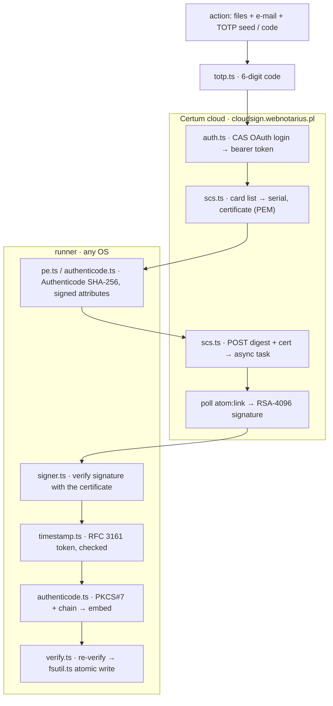

# The SimplySign cloud-signing flow, as implemented here

This is the HTTPS protocol the action speaks to Certum's SimplySign cloud
service, module by module. It follows the flow documented and validated by
[Le-Syl21/ssign](https://github.com/Le-Syl21/ssign) (see its
`docs/simplysign-protocol.md`, reverse-engineered from SimplySign Desktop
2.9.14 for interoperability), re-implemented from scratch in TypeScript on
Node 24. Only app-level constants and protocol structure appear here — no user
secret.

**Host:** `cloudsign.webnotarius.pl` (all API calls, HTTPS only).
**Timestamp authority:** `http://time.certum.pl/` (RFC 3161, replaceable).

> Not affiliated with or endorsed by Certum / Asseco. "Certum" and
> "SimplySign" are their trademarks; this is an independent client for their
> public API.



## 1 · One-time code — `totp.ts`

The account has no password. Login uses the e-mail and the current 6-digit
code of the SimplySign authenticator: TOTP (RFC 6238) with **SHA-256**, 6
digits, 30 s. The action accepts the seed as a bare base32 secret (Certum
defaults) or as an `otpauth://totp/...` URI (self-describing), or a literal
code for one-off runs. A code is accepted by the server **once**; the action
logs in once per run and signs every file on that session.

## 2 · Login — OAuth 2.0 authorization code via the CAS IdP — `auth.ts`

1. `GET /idp/oauth2.0/authorize?response_type=code&client_id=…&redirect_uri=https://cloudsign.webnotarius.pl/redirect&scope=…/idp/oauth2.0/profile&api_key=`
   → `302` → `GET /idp/login?service=…` → `200` HTML with hidden `execution`
   (and `lt`) fields.
2. `POST /idp/login?service=…` (form): `username` = e-mail, `password` = the
   6-digit code, `execution`, `_eventId=submit`, `geolocation=`,
   `submit=LOGIN`, `lt` → `302` chain: `callbackAuthorize?…&ticket=ST-…` →
   `authorize` → `redirect_uri?code=…`. The action reads `code` off the
   `Location` header of the last hop and **never requests the redirect
   target**.
3. `POST /idp/oauth2.0/accessToken?client_id=…&client_secret=…&scope=…&code=…&redirect_uri=…&grant_type=authorization_code`
   (empty body) → `{"access_token":…,"token_type":"bearer","expires_in":1800,…}`.

The `client_id` / `client_secret` are the 20-character web-login client
constants shipped with every SimplySign Desktop install — a public client in
the RFC 8252 sense, not an account secret. Every call from here carries
`Authorization: Bearer <access_token>`; the token lives in memory only.

## 3 · The SCS async task protocol — `scs.ts`

Card, certificate and signature endpoints are asynchronous:

```
POST …/tasks  (Accept: multipart/form-data, application/json)
  → 202 {"state":…,"atom:link":"<poll url>","ping-after":<ms>}
GET  <poll url>   → 303 {"atom:link":"<result url>"}     (when ready)
GET  <result url> → 200 <payload: JSON array or multipart/form-data>
```

`runTask` follows `atom:link` until a response no longer carries one, sleeping
`ping-after` clamped to 200–2000 ms, with a poll limit and a deadline. A link
whose origin is not the API origin is refused, so the bearer token cannot be
sent elsewhere. A `state: "failed"` body is an error.

## 4 · Card and certificate — `scs.ts`

* `POST /card/v1/cards/tasks` → `[{profile,label,cardno,pinrequired,maxkeysno,validthru}]`.
  The first card is used unless `card-serial` selects another; `pinrequired`
  must be `false` (the flow has no way to supply a PIN).
* `POST /card/v1/cards/{cardno}/certificates/tasks` → multipart with a
  `certificate` part: the signing certificate as PEM. It is kept **byte for
  byte** — the signature endpoint wants exactly what was issued — and parsed
  (DER) for validity, EKU and the `IssuerAndSerialNumber` the PKCS#7 needs.

## 5 · Authenticode digest and signed attributes — `pe.ts`, `authenticode.ts`

Locally, no network:

* `authenticodeHash` implements the algorithm of *Windows Authenticode
  Portable Executable Signature Format*: headers minus `CheckSum` and the
  security directory entry up to `SizeOfHeaders`, sections in
  `PointerToRawData` order, then trailing data minus the certificate table.
  For an unsigned file the 8-byte alignment padding that precedes the future
  certificate table is hashed too.
* `SpcIndirectDataContent { SpcPeImageData(flags=includeResources, <<<Obsolete>>>), DigestInfo(sha256, H) }`.
* Signed attributes (DER `SET OF`, sorted): `contentType = SPC_INDIRECT_DATA`,
  `signingTime`, `SpcStatementType = individual`, `messageDigest =
  SHA-256(SpcIndirectDataContent *content*)`, optional `SpcSpOpusInfo`
  (program name as a unicode SpcString, URL as an SpcLink).
* **What the cloud signs**: `SHA-256(signedAttrs as SET OF)`.

## 6 · Signature — `scs.ts` (SCS1_ATOM)

`POST /card/v1/cards/{cardno}/certificates/signature` as `multipart/form-data`:

* part `req` (`application/json;charset=UTF-8`):
  `{"digests":["<sha256 hex>"],"digesttype":"SHA256"}`
* part `certificate` (`application/octet-stream`, `filename="blob"`): the
  certificate PEM, verbatim.

→ `202` → poll → `200 [{"<digest hex>":"<signature hex>"}]` — an RSASSA-PKCS1-v1_5
signature over `DigestInfo(sha256, digest)`, 512 bytes for RSA-4096. The
action verifies it with the certificate's public key before going further.

## 7 · Timestamp — `timestamp.ts`

`TimeStampReq { version 1, messageImprint { sha256, SHA-256(signature) }, nonce, certReq TRUE }`
is POSTed as `application/timestamp-query`. The `TimeStampResp` must be
`granted`/`grantedWithMods`, and the token is checked: CMS `SignedData` over
`id-ct-TSTInfo`; `messageImprint` equals ours; `nonce` echoed; signature
verifies with the TSA certificate carried in the token (RSA PKCS#1 v1.5,
RSA-PSS or ECDSA); TSA certificate has `id-kp-timeStamping`.

## 8 · Assemble and embed — `authenticode.ts`, `pe.ts`

```
ContentInfo { signedData, [0] SignedData {
  version 1,
  digestAlgorithms { sha256 },
  contentInfo { SPC_INDIRECT_DATA, [0] SpcIndirectDataContent },
  certificates [0] { leaf, intermediates… },
  signerInfos { SignerInfo {
    version 1, IssuerAndSerialNumber, sha256,
    authenticatedAttributes [0] IMPLICIT <the signed SET>,
    rsaEncryption, signature,
    unauthenticatedAttributes [1] { 1.3.6.1.4.1.311.3.3.1 → TimeStampToken }
  } }
} }
```

The blob goes into a `WIN_CERTIFICATE` (revision 0x0200, type 0x0002) appended
on an 8-byte boundary; the security directory entry and the PE `CheckSum` are
updated. The intermediate embedded by default is *Certum Code Signing 2021
CA* (only when it actually issued the leaf); `chain-file` can add others.

## 9 · Self-verification — `verify.ts`

Before the file is written, the signed image is parsed and verified: embedded
digest vs. recomputed Authenticode digest, signed attributes, RSA signature
against the embedded signer certificate, timestamp against this signature.
This is the same check the test-suite runs against images signed by
Microsoft's `signtool`.

## Cross-checks performed

* `authenticodeHash(hello.exe)` equals the value osslsigncode computes for the
  same fixture (`BC17B1C9…`), pinned in the tests.
* `hello.exe` signed by `signtool sign /fd sha256 /td sha256 /tr http://time.certum.pl`
  (Windows SDK 10.0.28000, throwaway self-signed certificate) verifies with
  `verify.ts`: same digest, valid signature, and a genuine Certum
  "Certum Timestamp 2026" token that passes the RFC 3161 checks. The image is
  kept as `tests/fixtures/hello-signtool.exe`.
* `hello.exe` signed by this pipeline (mock cloud with a local RSA key, real
  Certum TSA) passes `signtool verify /pa /v` and PowerShell
  `Get-AuthenticodeSignature` up to chain trust: identical file hash, the
  embedded chain listed, *"The signature is timestamped … Timestamp Verified
  by: Certum Trusted Network CA → Certum Trusted Network CA 2 → Certum
  Timestamping 2021 CA → Certum Timestamp 2026"*. The only reported error is
  the untrusted test root, which is exactly what a self-signed test CA must
  produce.

## References

* Certum, *Code Signing in the Cloud — Signing in Signtool and Jarsigner*,
  ver. 1.1 (official handbook). It documents the SimplySign Desktop +
  signtool path (`signtool sign /sha1 <thumbprint> /tr http://time.certum.pl
  /td sha256 /fd sha256`), verification with `signtool verify /pa /all`, PIN
  and pinless cards, and the certificate bundle order (user certificate first,
  then the *Certum Code Signing 2021 CA* intermediate) — all of which this
  action reproduces without the desktop application.
* [Le-Syl21/ssign](https://github.com/Le-Syl21/ssign) — the reverse-engineered
  cloud protocol (`docs/simplysign-protocol.md`) and the reference Rust
  implementation this flow follows.
* Microsoft, *Windows Authenticode Portable Executable Signature Format*.
* RFC 3161 (Time-Stamp Protocol), RFC 5652 (CMS), RFC 6238 (TOTP).
